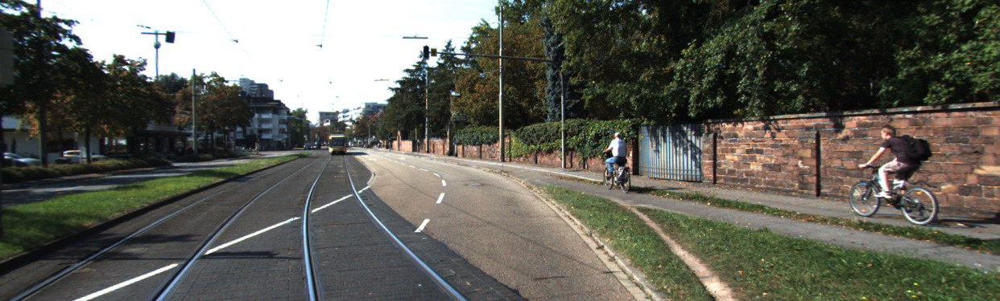
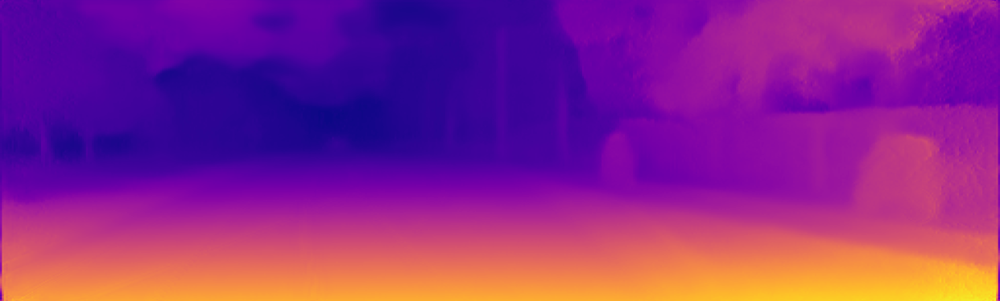

# Monodepth-PaddlePaddle

## 1. 简介

Monodepth是通过自监督学习进行单目深度估计的一种方法。其主要通过预测中间变量disparity(视差)来对一侧图像进行变换重建另一侧图像，并以重构损失进行训练。视差d与真正的深度图D之间存在着变换：D=bf/d，其中b为双目相机的间距，f为相机焦距。故当某一组相机配置固定时，得知视差图便相当于得到了深度图。

以下为官方模型在KITTI测试图像上的预测结果：






**论文:** [Unsupervised Monocular Depth Estimation with Left-Right Consistency](http://arxiv.org/abs/1609.03677)

**参考repo:** [monodepth](https://github.com/mrharicot/monodepth)

在此非常感谢`@mrharicot`等人贡献的[nomodepth](https://github.com/mrharicot/monodepth)，提高了本repo复现论文的效率。

**aistudio体验教程:** [地址](https://aistudio.baidu.com/aistudio/projectdetail/3295597)

## 2. 数据集

本项目使用两种数据集：KITTI数据集和Cityscapes数据集。

[KITTI](http://www.cvlibs.net/datasets/kitti/)是一个自动驾驶领域常用的数据集，其由配置了传感器的汽车于德国卡尔斯鲁厄采集，数据中包含了双目彩色图像、深度图像、雷达点云等传感数据，并提供目标检测、实例分割等常见CV任务的标签。本项目使用AI Studio上的KITTI压缩数据集，全部数据可从[此处](https://aistudio.baidu.com/aistudio/datasetdetail/15348)下载。在训练过程中只需要双目图像，所以只解压`jpg_images.tar.*`即可。

KITTI数据集存在两种划分，一种是官方标准划分，称为KITTI划分，另一种是Eigen et. al.提出的Eigen划分方式。领域内更常用Eigen划分进行评估。由于在评估时需要点云数据来计算深度图的groundtruth，解压全部点云数据集占用硬盘空间过大，我们对Eigen划分的测试集进行了单独的打包，可在[此处](https://aistudio.baidu.com/aistudio/datasetdetail/124009)下载。

[Cityscapes](https://www.cityscapes-dataset.com/)也是自动驾驶领域的常用数据集，出现时间晚于KITTI，其同样是配置了传感器的汽车进行采集，采集的范围扩大到了德国的50座城市，包含了20k+对高清的双目城市图像，并提供了实例分割任务标签。数据集中原始数据为`.png`格式，占用空间较大，按照原仓库设置，使用`convert -quality 92 -sampling-factor 2x2,1x1,1x1 {.}.png {.}.jpg && rm {}`将`.png`压缩为`.jpg`格式。压缩后的双目数据集可从[此处](https://aistudio.baidu.com/aistudio/datasetdetail/124090)下载。

本地运行代码的同学需自行下载三个数据集进行解压。

## 3. 复现精度

按照原文中最优结果的设置，首先在Cityscapes数据集上预训练模型，之后在KITTI上进行finetune。

两次训练采用相同且与原文代码一致的训练参数：batch size 8，epoch 50，优化器Adam，初始学习率1e-4，30个epoch后减小为5e-5，40个epoch后减小为2.5e-5。原文和仓库并没有提供最优模型的选择方法，我们保存验证集loss最低的模型为最优模型。

|       |  abs_rel  |sq_rel| rms |log_rms|d1_all| a1  | a2  | a3  |
|-------|-----------|------|-----|-------|------|-----|-----|-----|
|原文精度|  0.1304   |1.1965|5.222| 0.226 |0.000 |0.843|0.940|0.971|
|复现精度|**0.1290** |1.2393|5.265| 0.226 |0.000 |0.843|0.941|0.972|

训练日志链接：[cityscapes log](logs/cityscapes.log), [eigen log](logs/city2eigen.log)
权重文件链接：[official tensorflow weight](https://github.com/IcarusWizard/monodepth-paddle/releases/download/v0.1/tensorflow_city2eigen_resnet.h5), [cityscapes pretrained weight](https://github.com/IcarusWizard/monodepth-paddle/releases/download/v0.1/city_resnet.pdparams), [city2eigen finetuned weight](https://github.com/IcarusWizard/monodepth-paddle/releases/download/v0.1/city2eigen_resnet.pdparams)

## 4. 快速开始

### 准备环境
- 硬件：CPU or GPU
- 框架：
  - python>=3.7
  - PaddlePaddle=2.2.1

首先根据机器情况安装paddlepaddle，对于需要训练的同学**强烈建议使用GPU**。对于有GPU的机器使用`pip install paddlepaddle-gpu==2.2.1`，对于没有GPU的机器使用`pip install paddlepaddle==2.2.1`。更多安装方式可以参考[PaddlePaddle官网](https://www.paddlepaddle.org.cn/)。

在安装完PaddlePaddle之后，直接使用`pip install -r requirements.txt`安装其他依赖。

#### 训练
```
## pretrained on Cityscapes
python main.py --mode train \
    --data_path <path to Cityscapes dataset> --dataset cityscapes \
    --filenames_train eval/filenames/cityscapes_train_files.txt --filenames_val eval/filenames/cityscapes_val_files.txt \
    --log_directory logs --model_name city_resnet --encoder resnet

## finetuned on KITTI
python main.py --mode train \
    --data_path <path to KITTI dataset> --dataset kitti \
    --filenames_train filenames/eigen_train_files.txt --filenames_val filenames/eigen_val_files.txt \
    --log_directory logs --model_name city2kitti_resnet --encoder resnet \
    --checkpoint logs/city_resnet/best_val_weight.pdparams
```

#### 测试
```
python main.py --mode test \
    --data_path <path to KITTI Eigen Test> \
    --filenames_test filenames/eigen_test_files.txt --log logs \
    --output_directory outputs \
    --encoder resnet --checkpoint_path logs/city2kitti_resnet/best_val_weight.pdparams
```

#### 评估
`python eval/evaluate_kitti.py --split eigen --predicted_disp_path outputs/disparities_pp.npy --gt_path <path to KITTI Eigen Test>`

#### Demo
项目同时提供以单帧图像为输入的demo，直接预测视差图，命令如下：
`python demo.py --image_path <path to the test image> --checkpoint_path <path to the weights>`

**注意：**预测得到的结果为视差图d，真正的深度图D=k/d，其中k为某与相机相关的常数，需要深度图的同学可以针对自己的问题手动调整这个常数得到合理的深度图。

## 4. 代码结构

```
├── eval
|   ├── evaluation_utils.py # 评测辅助函数
│   └── evaluate_kitti.py # 评测脚本
├── filenames/ # 各个数据集的训练、验证、测试集划分
├── LICENSE
├── README.md
├── data.py # 数据集定义
├── main.py # 主入口，训练/测试
├── model.py # 网络定义
├── demo.py # 单张图像深度估计脚本
├── requirements.txt # 依赖包
└── utils.py # 功能函数
```

## 5. 复现心得
需要注意的细节：
- `paddle.meshgrid`和`np.meshgrid`效果不同，`np.meshgrid(x, y)`等价于`paddle.meshgrid(y, x)`。
- `paddle.gather`存在bug，会强行对不可导的`index`进行求导，导致报错，故需要对`index`进行`detach`。
- 进行水平翻转数据增强时，左右图像需要换位。（非常重要，否则模型会躺平...）
- 在Cityscapes数据集在Eigen测试集上的表现并不好，这是由于两个数据集的相机不同内参及配置方式不同，导致了两者的视差图相差了某常数倍。

也许是受限于当时的显存限制，原文的训练使用了仅为8的batchsize，这对于进行了如此复杂的数据增强的模型来说可能过小，增大batch size或许有助于进一步提升性能；另外，在实验中我注意到在每次lr decay时验证集损失会有一个阶梯式的下降并迅速饱和，这与之前resnet在图像分类时的实验现象一致，所以相应的，改变学习率衰减策略为cosine也许会更好。感兴趣的同学可以继续调参~